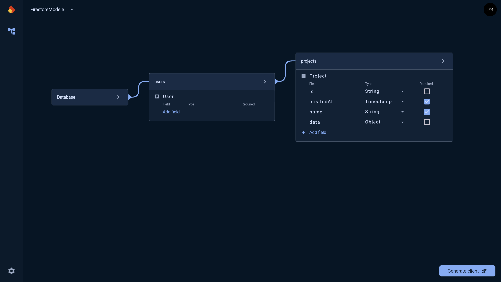

# FirestoreModeler

FirestoreModeler is a specialized visual database schema designer for Firestore, aimed at simplifying the process of creating and managing Firestore database structures.

# 👉 [Try the Beta Now](https://firestoremodeler.com)

## 🚀 Features

- **Visual Schema Design**: Easily create and modify your Firestore database schema using an intuitive visual interface.
- **Code Generation**: Export client-side code by simply copying and pasting the generated code.
- **Firestore-Focused**: FirestoreModeler is tailored specifically for Firestore, offering a streamlined experience.

## 🚧 Current Status

FirestoreModeler is currently in active development. The basic version is functional, and we're putting the finishing touches on it before the initial release.

## 📅 Roadmap

- [x] Basic visual schema designer
- [x] Code generation for Dart
- [ ] Code generation for JavaScript
- [ ] Firestore's rules generator

## 📣 Feedback

We're always looking to improve! If you have any suggestions, questions, or just want to chat about FirestoreModeler, feel free to:

- Open an issue in this repository
- Follow our development updates on [Twitter](https://twitter.com/pierremartin_)