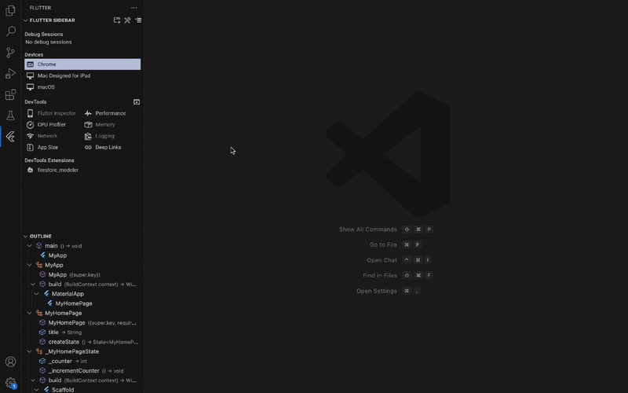

# Firestore Modeler

A DevTools extension that generates type-safe Dart clients for Firestore.



## Installation

1. Add the package to your project:
```bash
dart pub add firestore_modeler
```

# Setup

1. Enable the extension in Dart DevTools

2. Configure the package:

Firestore Modeler will prompt you to create a configuration file (firestore_modeler.yaml).
This file must be in your project directory that has firestore_modeler listed as a dependency.


⚠️ Note: DevTools may have issues with copy/paste operations when used within IDEs. For the initial setup, we recommend using Chrome DevTools instead.


3. Define your Firestore database schema:


4. Generate the client code:

Click the "Generate" button in the bottom right corner
A firestore_client.dart file will be created next to your firestore_modeler.yaml configuration file


# Client Usage

The client is generated using a modified version of cloud_firestore_odm.

```dart
// Create a collection reference
final rootCollection = [YourRootCollectionClass]CollectionReference();

final docRef = rootCollection.doc('id');

// You can access sub-collections from a document reference
final subCollection = docRef.mySubCollection;

// Typed CRUD operations
// The generator also generate necessary models
final MyModel data = await docRef.get();
await docRef.set(MyModel());
await docRef.update(MyModel());
await docRef.delete();

// Get a stream
collectionRef.snaphots()
docRef.snaphots()

// Query data
collectionRef.orderBy[Property]()
collectionRef.where[Property]()
collectionRef.limit()
collectionRef.select()
```